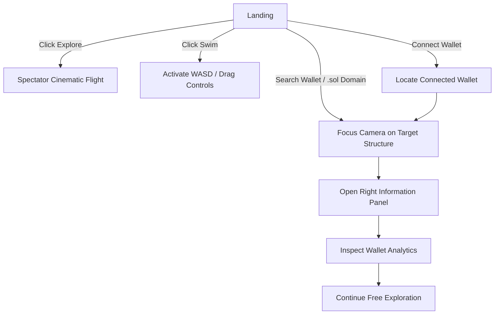

## Navigation Flow

### Overview

Onchain Ocean is a futuristic Atlantis-inspired underwater civilization built on top of real Solana blockchain data.

Users can connect wallets, search `.sol` domains or wallet addresses, and explore blockchain activity as architectural structures inside a living 3D ocean world. Wallets become cities, protocols become headquarters, communities become districts, and transactions travel through the ocean as bioluminescent traffic routes.

### Flow Explanation

The user begins at the Landing experience and can choose one of four primary actions:

- **Explore** launches a cinematic spectator flight through the blockchain metropolis.
- **Swim** activates free-form underwater exploration using WASD controls.
- **Search Wallet / .sol Domain** focuses the camera on a specific blockchain structure.
- **Connect Wallet** automatically locates and navigates to the connected wallet's structure.

Once a structure is selected, the Right Information Panel opens and displays:

- Wallet information
- SOL balance
- Transaction statistics
- Protocol interactions
- Community affiliations
- Activity timeline
- Connected structures

After inspection, users can continue exploring the world without being forced back to the lobby.

### Key Features

#### Wallet & Blockchain Integration
- Phantom Wallet integration
- Solflare Wallet integration
- Real Solana RPC connectivity
- Wallet balance retrieval
- Transaction history tracking
- Wallet age estimation
- Protocol interaction detection
- Connected wallet relationship mapping
- Solana Name Service (.sol) support
- Reverse wallet lookup

#### Search & Navigation
- Wallet address search
- .sol domain search
- Dynamic structure generation
- Camera focus system
- Interactive structure selection
- Detailed wallet inspection panel

#### 3D Exploration World
- Atlantis-inspired underwater metropolis
- Ocean fog and atmospheric lighting
- Free-swim camera controls
- Bioluminescent transaction traffic
- Dynamic city districts
- Blockchain landmark architecture

### Current Project Status

| Area | Completion |
|--------|------------|
| Backend Systems | 90–95% |
| Core Functionality | 95% |
| Visual Experience | 70–75% |
| Final Polish | In Progress |

### Remaining Work

#### Stage 6 — Visual Polish
- Improved lighting
- Better architectural visibility
- Enhanced underwater atmosphere
- Volumetric effects
- Ocean ecosystem life
- Particle systems
- Environmental storytelling

#### Stage 7 — Final Refinement
- Cinematic camera polish
- Material quality improvements
- Advanced lighting refinement
- Atlantis-scale visual presentation
- Final environment optimization

### Goal

Transform the existing functional blockchain civilization into a visually stunning, cinematic Atlantis-scale underwater metropolis while preserving all completed wallet, search, telemetry, and exploration systems.

🌊🏙️✨
